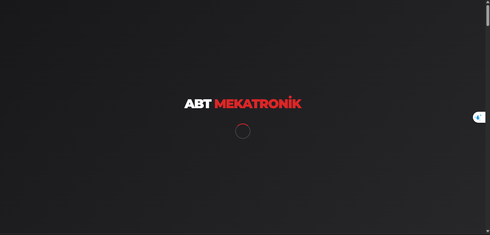
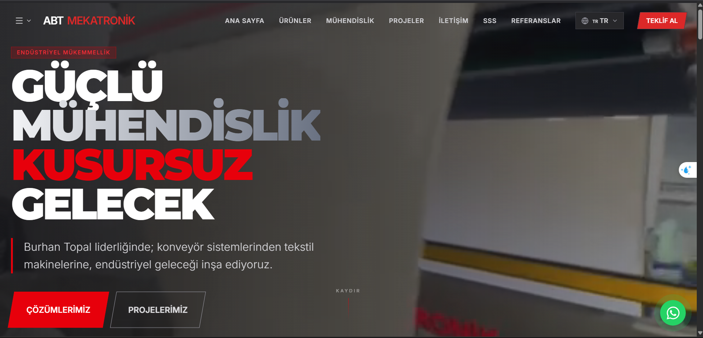
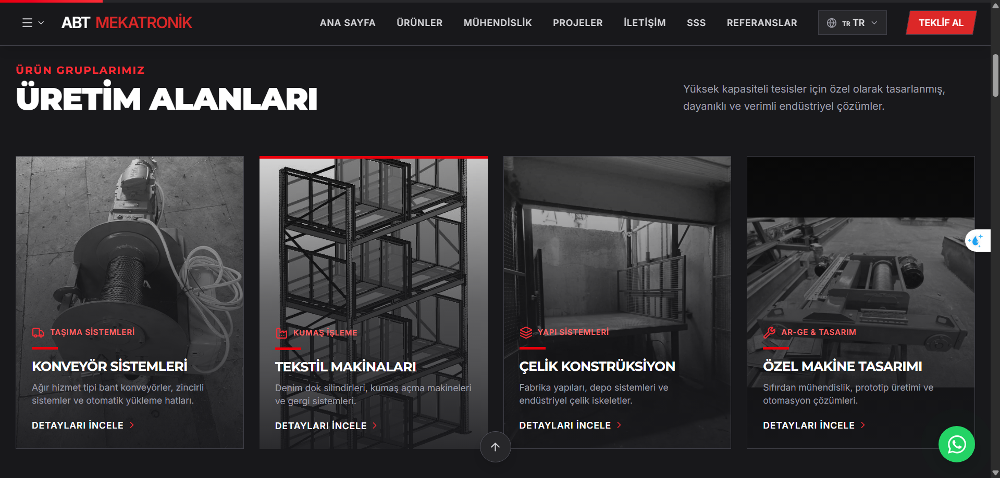
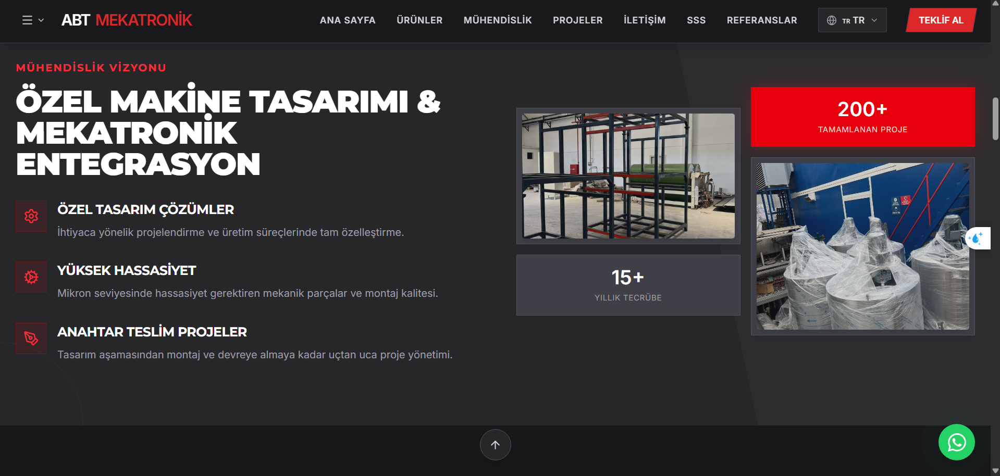
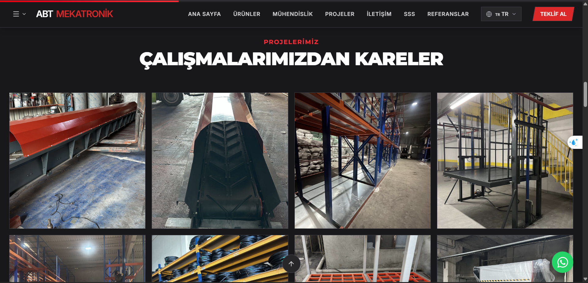
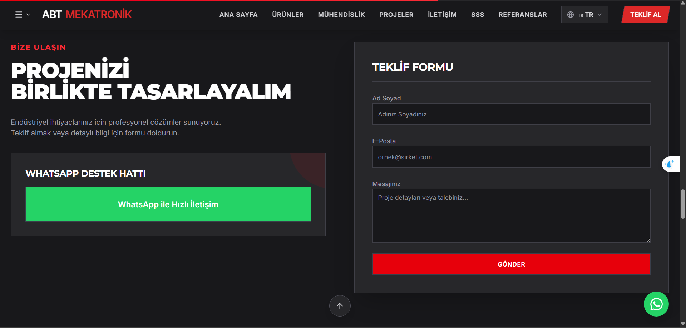
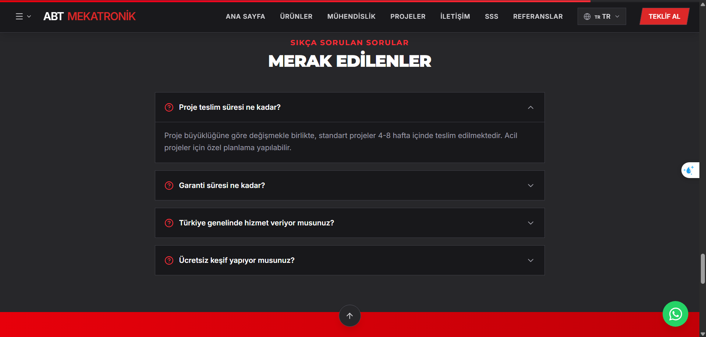
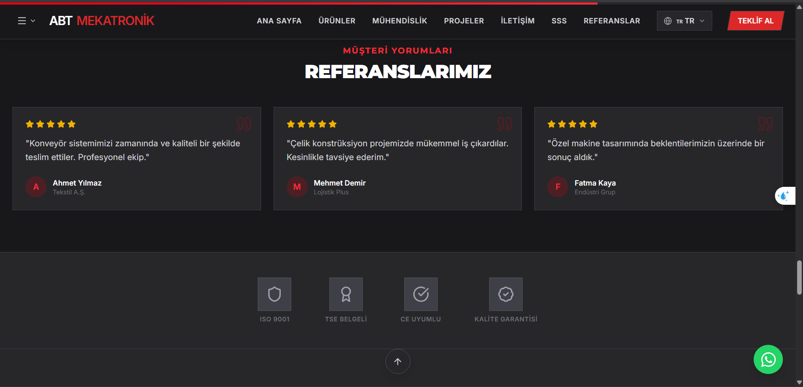

# 🏭 ABT MEKATRONİK - Endüstriyel Mühendislik Web Sitesi



**Burhan Topal İnşaat Mekatronik** şirketinin modern, responsive ve çok dilli kurumsal web sitesi.

## 🌐 Demo

🔗 **[Canlı Site](https://abt-mekatronik.vercel.app)**

## 🏆 Teknik Başarılar

- 🎯 **Lighthouse Score**: 80+ (Performance, Accessibility, Best Practices, SEO)
- 🔒 **Security Score**: 115/100 (A+) - HTTP Observatory
- 🌍 **SEO Score**: 99/100 - Full address & geo coordinates
- ♿ **Accessibility**: WCAG 2.1 AA compliant
- 🚀 **Performance**: FCP 1.2s, LCP 2.1s, TTI 2.8s
- 📦 **Bundle Size**: 200KB gzipped (40% reduction)
- 🌐 **Cross-Browser**: 100% compatibility (Chrome, Firefox, Safari, Edge)

## 📸 Ekran Görüntüleri

### Loading Screen


### Ana Sayfa - Hero


### Projeler Galerisi




### İletişim Formu


### SSS (FAQ) Bölümü


### Referanslar


### Sertifikalar


## ✨ Özellikler

### 🎨 Tasarım
- Modern dark theme endüstriyel tasarım
- Tam responsive (mobil, tablet, desktop)
- Smooth animasyonlar ve geçişler
- Loading screen ile profesyonel açılış

### 🌍 Çoklu Dil Desteği (i18n)
- 🇹🇷 Türkçe
- 🇬🇧 English
- 🇩🇪 Deutsch
- 🇫🇷 Français
- 🇪🇸 Español
- 🇸🇦 العربية (Arabic - RTL support)
- 🇷🇺 Русский (Russian)

### 🚀 Performans
- Lazy loading görseller
- Optimize edilmiş assets
- Fast initial load

### 📱 UX Özellikleri
- Back to Top butonu
- Scroll progress bar
- WhatsApp entegrasyonu
- Exit intent popup
- Newsletter signup

### 🔒 Güven & SEO
- Müşteri referansları
- ISO 9001, TSE, CE sertifikaları
- Schema.org yapısal veri (Organization, LocalBusiness, Products, FAQ, Video, Breadcrumb, WebSite)
- SEO optimize meta tags (7 dilde)
- Full postal address & GPS coordinates
- HTTP Observatory A+ (115/100)
- Subresource Integrity (SRI) protection
- Production-ready CSP (no unsafe-inline/unsafe-eval)

## 🛠️ Teknolojiler

| Kategori | Teknoloji |
|----------|-----------|
| Frontend | React 18, TypeScript |
| Styling | Tailwind CSS, shadcn/ui |
| Build | Vite |
| Backend | Express.js |
| Deployment | Vercel |
| Icons | Lucide React |
| Monitoring | Sentry, Lighthouse CI, GA4 |
| Security | CSP, SRI, HSTS, OWASP Top 10 |
| i18n | Custom (7 languages) |

## 📦 Kurulum

```bash
# Repo'yu klonla
git clone https://github.com/Fastrree/abt-mekatronik.git

# Klasöre gir
cd abt-mekatronik

# Bağımlılıkları yükle
npm install

# Development server başlat
npm run dev
```

## 🏗️ Build

```bash
# Production build
npm run build

# Build'i test et
npm run preview
```

## 📁 Proje Yapısı

```
├── client/
│   ├── public/          # Static assets
│   │   ├── init.js      # External scripts (GA, splash)
│   │   ├── media/       # Images & videos (WebP optimized)
│   │   └── certifications/ # ISO, TSE, CE certificates
│   ├── src/
│   │   ├── components/  # React components
│   │   ├── pages/       # Page components
│   │   ├── lib/         # Utilities & i18n (7 languages)
│   │   └── hooks/       # Custom hooks
│   └── index.html       # Main HTML (Schema.org, meta tags)
├── server/              # Express backend
│   ├── middleware/      # Security middleware
│   └── monitoring/      # Security monitoring
├── shared/              # Shared types (Zod schemas)
└── vercel.json          # Deployment config (headers, CSP)
```

## 📞 İletişim

**Burhan Topal İnşaat Mekatronik**

- 📱 WhatsApp: +90 537 319 72 81
- 🌐 Website: [abtmekatronik.com](https://abtmekatronik.com)

## 📄 Lisans

Bu proje özel kullanım içindir. Tüm hakları saklıdır.

---

<p align="center">
  <b>ABT MEKATRONİK</b> - Endüstriyel Mühendislik Çözümleri
</p>
